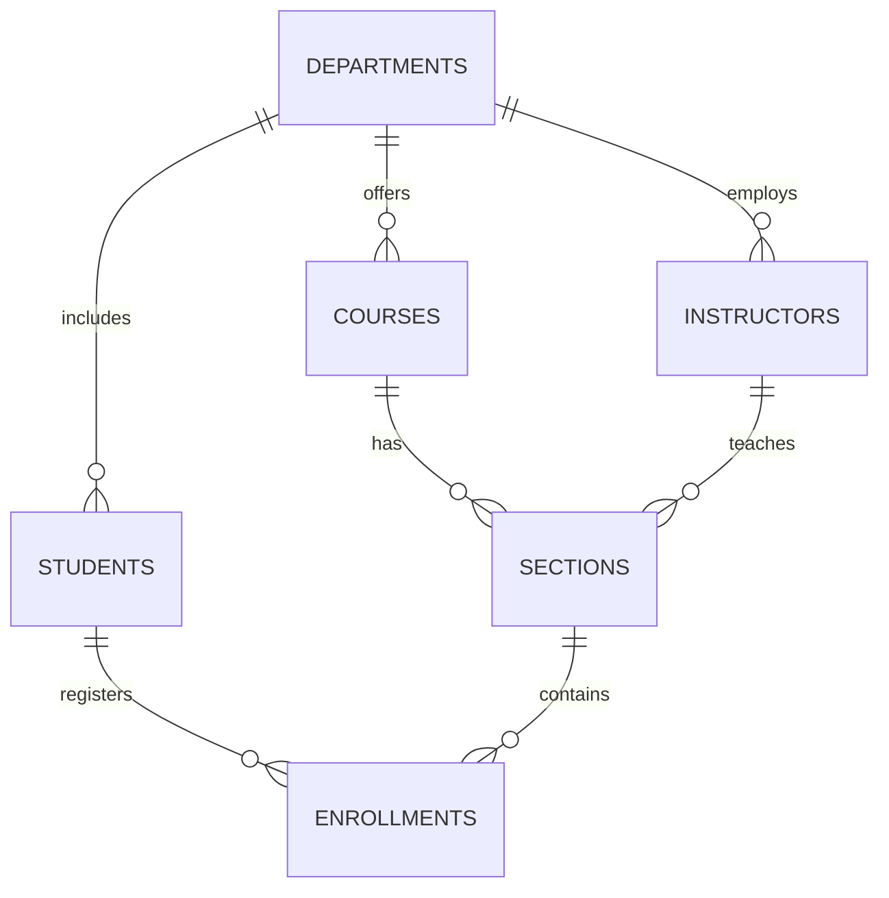

# University Registration Database

A relational database for managing university departments, students, instructors, courses, class sections, and enrollments.

## Database design



The `enrollments` table resolves the many-to-many relationship between students and class sections. Primary keys identify each record, foreign keys protect relationships, and constraints prevent invalid credits, capacities, statuses, and duplicate registrations.

## Files

- `schema.sql` creates the tables, relationships, constraints, and indexes.
- `sample_data.sql` adds fictional records for testing.
- `queries.sql` contains registration and reporting queries.

## Run with SQLite

```bash
sqlite3 university.db < schema.sql
sqlite3 university.db < sample_data.sql
sqlite3 -header -column university.db < queries.sql
```

The project uses standard relational SQL with SQLite for a lightweight local setup.

## Skills demonstrated

- Relational database design
- One-to-many and many-to-many relationships
- Primary and foreign keys
- Data validation with constraints
- Joins, aggregations, grouping, and conditional calculations
- Indexes for commonly searched relationships
